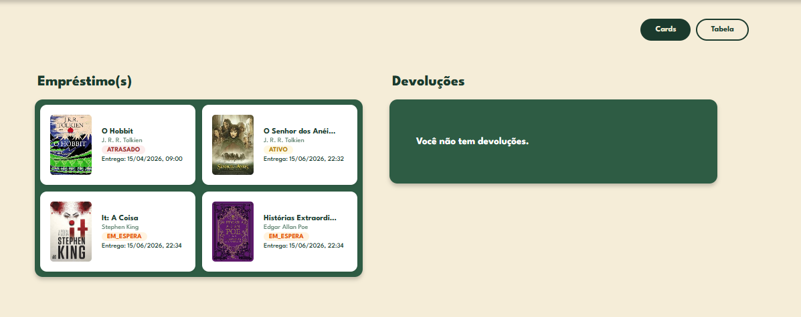
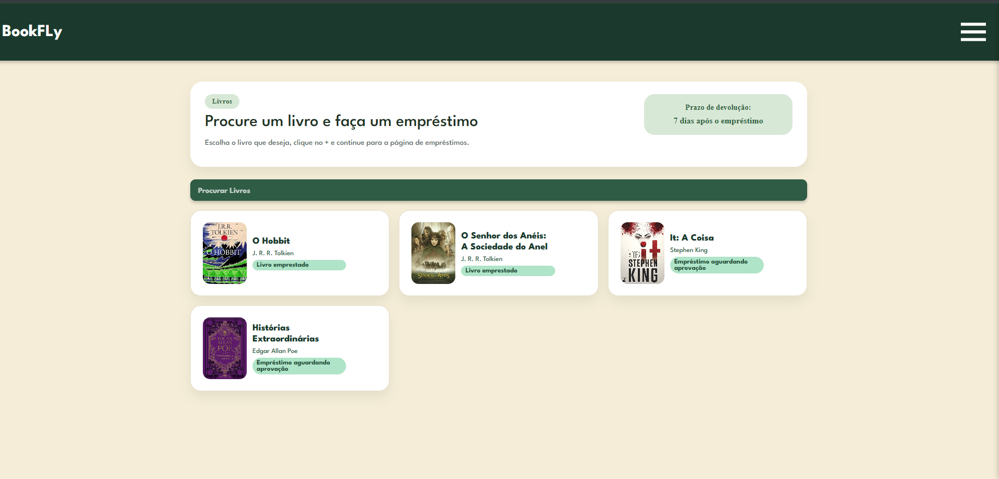
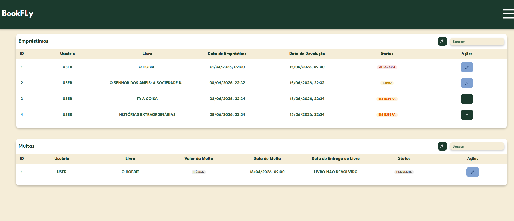
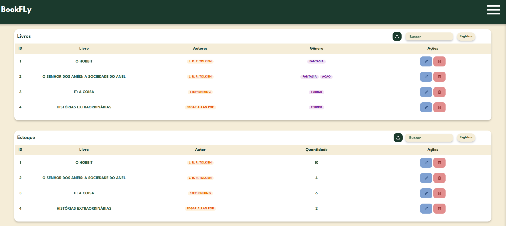

<div align="center">

# 📚 BookFly

**Sistema web de gerenciamento de empréstimos de livros**


</div>

---

## 📖 Sobre o Projeto

O **BookFly** é um sistema web completo para o gerenciamento de acervos e empréstimos de livros, desenvolvido para bibliotecas institucionais. Ele oferece controle de todo o ciclo de vida de um livro dentro da instituição — do cadastro ao empréstimo, da devolução à cobrança de multa — com uma interface intuitiva e uma API RESTful robusta.

O sistema foi desenvolvido como projeto de estágio na **Secretaria de Estado da Segurança Pública do Maranhão (SSP/MA)** e construído do zero com foco em boas práticas de engenharia de software.

    
---

## ✨ Funcionalidades

### Gestão de Livros e Acervo
- Cadastro de livros com título, capa, gênero e autor(es)
- Controle de estoque por exemplar (`StockBook`)
- Registro de movimentações de entrada e saída de exemplares
- Exportação de relatórios de movimentações em **PDF**

### Gestão de Empréstimos
- Criação, ativação, edição e cancelamento de empréstimos
- Controle de data de empréstimo e data de devolução
- Status do empréstimo: `ACTIVE`, `RETURNED`, `CANCELLED`, `OVERDUE`
- Listagem de empréstimos por usuário
- Exportação de relatório de empréstimos em **PDF**

### Multas (Penalidades)
- Cálculo automático de multa por atraso na devolução (**R$ 1,50 por dia**)
- Registro e controle do pagamento de penalidades
- Status da multa: `PENDING`, `PAID`

### Gestão de Usuários
- Cadastro de usuários com papéis: `ADMIN` e `USER`
- Perfil de usuário editável
- Estante pessoal (`Bookcase`) para organização de leituras

### Auditoria
- Registro automático de ações sensíveis via `@Auditable` (AOP)
- Log de exportações de relatórios

### Interface Web
- Dashboard com cards e tabelas de visão geral
- Tabelas paginadas e reutilizáveis com modais de edição e exclusão
- Sistema de notificações via toast (sem `alert()` nativo)
- Proteção de rotas via `authGuard.js`
- Serviço centralizado de chamadas à API (`apiService.js`)
- Páginas: Login, Cadastro, Dashboard, Livros, Estoque, Empréstimos, Multas, Movimentações, Usuários, Perfil, Meus Livros

---

## 🛠️ Tecnologias Utilizadas

### Back-end
| Tecnologia | Versão |
|---|---|
| Java | 17 |
| Spring Boot | 4.0.5 |
| Spring Data JPA + Hibernate | — |
| PostgreSQL | 16+ |
| Lombok | — |
| SpringDoc OpenAPI (Swagger) | 3.0.2 |
| OpenPDF | 1.3.30 |
| Spring DevTools | — |

### Front-end
| Tecnologia | Descrição |
|---|---|
| HTML5 | Estrutura das páginas |
| CSS3 | Estilização e layout |
| JavaScript (ES6+) | Lógica e integração com a API |

---

## 📁 Estrutura do Projeto

```
bookfly/
├── bookfly-api/                  # Back-end (Spring Boot)
│   ├── src/main/java/com/jefferson/bookfly_api/
│   │   ├── annotation/           # @Auditable (AOP)
│   │   ├── config/               # SecurityConfig, CORS, Swagger, AuditAspect
│   │   ├── controllers/          # Endpoints REST
│   │   │   ├── AuthorController
│   │   │   ├── BookController
│   │   │   ├── BookcaseController
│   │   │   ├── LoanController
│   │   │   ├── MovimentController
│   │   │   ├── PenaltyController
│   │   │   ├── StockBookController
│   │   │   └── UserController
│   │   ├── dto/                  # Records de request/response por domínio
│   │   ├── enums/                # Gender, Role, StatusLoan, StatusPenalty, TypeMoviment
│   │   ├── exceptions/           # NotFoundException, DependencyViolationException
│   │   ├── interfaces/           # IPdfReportStrategy, IPenalty, IRecordStatus
│   │   ├── models/               # Entidades JPA
│   │   │   ├── Author, Book, Bookcase
│   │   │   ├── Loan, Moviment, Penalty
│   │   │   ├── RecordStatus, Stock, StockBook, User
│   │   │   └── AuditLog
│   │   ├── repository/           # Repositórios Spring Data
│   │   ├── service/              # Regras de negócio
│   │   └── strategy/pdf/         # Strategy para geração de PDFs
│   └── src/main/resources/
│       └── application.properties
│
└── Interface/                    # Front-end (Vanilla)
    ├── pages/                    # HTMLs de cada tela
    ├── scripts/                  # JS por funcionalidade
    │   ├── apiService.js         # Centraliza chamadas HTTP
    │   ├── authGuard.js          # Proteção de rotas
    │   ├── table.js              # Componente de tabela reutilizável
    │   ├── modal.js              # Componente de modal reutilizável
    │   └── search.js             # Lógica de busca/filtro
    └── styles/                   # CSS por componente
```

---

## ⚙️ Como Rodar o Projeto

### Pré-requisitos

Certifique-se de ter instalado:

- [Java 17+](https://adoptium.net/)
- [Maven 3.9+](https://maven.apache.org/) (ou use o `mvnw` incluso no projeto)
- [PostgreSQL 14+](https://www.postgresql.org/)
- Um navegador moderno (Chrome, Firefox, Edge)

---

### 1. Clonar o repositório

```bash
git clone https://github.com/JeffSSampaio/bookfly.git
cd bookfly
```

---

### 2. Configurar o Banco de Dados

Crie o banco de dados no PostgreSQL:

```sql
CREATE DATABASE bookfly;
```

No arquivo `bookfly-api/src/main/resources/application.properties`, configure as credenciais:

```properties
spring.datasource.url=jdbc:postgresql://localhost:5432/bookfly
spring.datasource.username=SEU_USUARIO
spring.datasource.password=SUA_SENHA

spring.jpa.hibernate.ddl-auto=update
spring.jpa.show-sql=true
```

> O Spring Boot criará as tabelas automaticamente na primeira execução via JPA.

---

### 3. Rodar o Back-end

```bash
cd bookfly-api

# Usando Maven instalado no sistema
mvn spring-boot:run

# Ou usando o wrapper incluso (sem precisar instalar o Maven)
./mvnw spring-boot:run        # Linux/Mac
mvnw.cmd spring-boot:run      # Windows
```

A API estará disponível em: **`http://localhost:8080`**

---

### 4. Acessar a Documentação da API (Swagger)

Com a API rodando, acesse:

```
http://localhost:8080/swagger-ui.html
```

Todos os endpoints estão documentados e podem ser testados diretamente pelo Swagger UI.

---

### 5. Abrir o Front-end

O front-end é composto por arquivos estáticos (HTML/CSS/JS). Para rodá-lo:

**Opção 1 — Extensão Live Server (VS Code):**
1. Abra a pasta `Interface/` no VS Code
2. Instale a extensão **Live Server**
3. Clique com o botão direito em `pages/login.html` → **Open with Live Server**

**Opção 2 — Diretamente no navegador:**
- Abra o arquivo `Interface/pages/login.html` no seu navegador

> ⚠️ Certifique-se de que o back-end esteja rodando antes de usar a interface, pois todas as ações dependem da API.

---

## 🔌 Endpoints Principais da API

| Método | Endpoint | Descrição |
|---|---|---|
| `POST` | `/api/users/create` | Cadastrar usuário |
| `GET` | `/api/users/list` | Listar usuários ativos |
| `GET` | `/api/books/list` | Listar livros ativos |
| `POST` | `/api/books/create` | Cadastrar livro |
| `GET` | `/api/loans/list` | Listar empréstimos ativos |
| `POST` | `/api/loans/create` | Criar empréstimo |
| `PUT` | `/api/loans/return/{loanId}` | Devolver livro |
| `PUT` | `/api/loans/cancel/{loanId}` | Cancelar empréstimo |
| `GET` | `/api/loans/pdf` | Exportar relatório em PDF |
| `GET` | `/api/penalties/list` | Listar multas |
| `PUT` | `/api/penalties/pay/{id}` | Registrar pagamento de multa |
| `GET` | `/api/moviments/list` | Listar movimentações |
| `GET` | `/api/moviments/pdf` | Exportar movimentações em PDF |

> Consulte a documentação completa em `/swagger-ui.html` com a aplicação rodando.

---

## 🧠 Decisões Técnicas

- **Soft Delete via `RecordStatus`:** nenhum dado é removido permanentemente do banco. Registros deletados recebem o status `DELETED`, mantendo o histórico íntegro.
- **DTOs com `record` e factory `from()`:** respostas da API são mapeadas via Java Records com método estático `from(Entity)`, evitando exposição direta das entidades.
- **Strategy Pattern para PDF:** a geração de relatórios segue o padrão Strategy (`IPdfReportStrategy`), permitindo adicionar novos tipos de relatório sem alterar o `PdfService`.
- **AOP para Auditoria:** a anotação `@Auditable` intercepta métodos sensíveis e persiste logs de forma transparente, sem poluir a lógica de negócio.
- **CORS configurado:** a API aceita requisições do front-end rodando em qualquer origem durante o desenvolvimento.

---

## 🏷️ Versão

| Versão | Data | Descrição |
|---|---|---|
| `v1.0.0` | Junho/2026 | Primeira versão — sistema completo de gerenciamento de empréstimos |

---

## 👨‍💻 Autor


**Jefferson Sousa Sampaio Junior**

[](https://github.com/JeffSSampaio)
[](https://linkedin.com/in/jeffersonssampaio)

---

## 📄 Licença

Este projeto está sob a licença MIT. Sinta-se livre para usá-lo, estudá-lo e adaptá-lo.